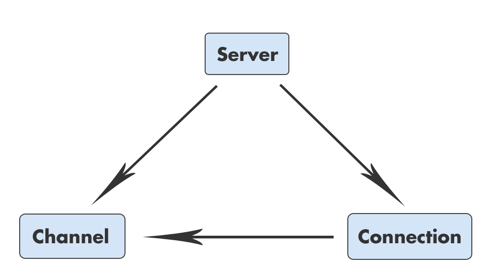

!SLIDE
# There’s a few bits missing

    @@@ ruby
    # Server#accept_connection
    connection.callback(&callback)
    
    # Connection#subscribe
    channel.add_listener(:receive) do |message|
    
    # Channel#<<
    publish(:receive, message)
    
    # Connection#subscribe
    succeed(message)

!SLIDE bullets
# Publisher

* `#add_listener(event_type, &block)`
* `#publish(event_type, data)`

!SLIDE
# Publisher

    @@@ ruby
    module Publisher
      def add_listener(event_type, &block)
        @callbacks ||= {}
        @callbacks[event_type] ||= []
        @callbacks[event_type] << block
      end
      
      def publish(event_type, data)
        return unless @callbacks and @callbacks[event_type]
        @callbacks[event_type].each do |callback|
          callback.call(data)
        end
      end
    end

!SLIDE bullets
# Deferrable

* `#callback(&block)`
* `#succeed(data)`
* `#defer()`

!SLIDE
# Deferrable

    @@@ ruby
    module Deferrable
      def defer()
        @status = :deferred
        @value  = nil
      end
      
      def succeed(data)
        @status = :success
        @value  = data
        @callbacks.each { |callback| callback.call(data) }
        @callbacks = []
      end
      
      def callback(&block)
        return block.call(@value) if @status == :success
        @callbacks ||= []
        @callbacks << block
      end
    end

!SLIDE center
# Cyclic data flow

!SLIDE center
# Non-cyclic dependencies

!SLIDE bullets
# Event-driven programming

* Keeps components decoupled
* Expresses _why_ and _when_, not just _what_
* Helps with non-blocking I/O

