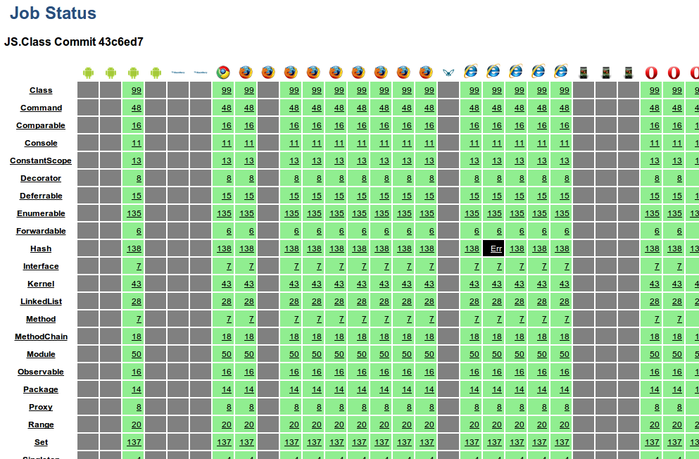

!SLIDE title
# We can go faster than that
## Where we’re going we don’t need a browser

!SLIDE
# Node.js test runner

    @@@javascript
    // spec/js/console.js
    
    JSCLASS_PATH = 'node_modules/jsclass/src'
    require('../../' + JSCLASS_PATH + '/loader')

    jQuery = $ = {}
    zxcvbn = function() { return {entropy: 10} }

    require('./runner')

!SLIDE
# Skip the UI tests

    @@@javascript
    describe("user interface", function() { with(this) {
      if (typeof window === "undefined") return
      
      it("displays an error when the user makes a mistake",
      function() { with(this) {
      
      // etc.
    }})

!SLIDE commandline incremental

    $ node spec/js/console.js 
    Loaded suite App
    Started
    .....
    Finished in 0.003 seconds
    5 tests, 5 assertions, 0 failures, 0 errors

!SLIDE title
# 6000x faster than Selenium
## Mention __that__ in your next performance review

!SLIDE title
# Missing your DOM tests? Use PhantomJS
## http://phantomjs.org/

!SLIDE

    @@@javascript
    // spec/js/phantom.js
    
    var page = new WebPage()

    page.onConsoleMessage = function(message) {
      try {
        var data = JSON.parse(message).jstest
        // process JSON console output
        
      } catch (e) {}
    }
    
    page.open('spec/js/browser.html')

!SLIDE commandline incremental

    $ time phantomjs spec/js/phantom.js 
    [PASSED] App user interface displays an error if the username is taken
    [PASSED] App user interface displays an error when the user makes a mistake
    [PASSED] App user interface submits the form when the data is valid
    [PASSED] App validation rules yields an error if the email is invalid
    [PASSED] App validation rules yields an error if the password is weak
    [PASSED] App validation rules yields an error if the username is blank
    [PASSED] App validation rules yields an error if there is an existing user
    [PASSED] App validation rules yields no errors for valid data
    8 tests, 0 failures, 0 errors

    real	0m1.641s

!SLIDE title
# What about automated cross-platform tests?
## You’ve got static HTML and JS, it runs anywhere

!SLIDE title
# TestSwarm
## http://swarm.jquery.org/

!SLIDE

!SLIDE

!SLIDE title
# BrowserStack
## http://www.browserstack.com/

!SLIDE

!SLIDE bullets
# Also worth a look
* Buster.js -- http://busterjs.org/
* Testling -- http://testling.com/

