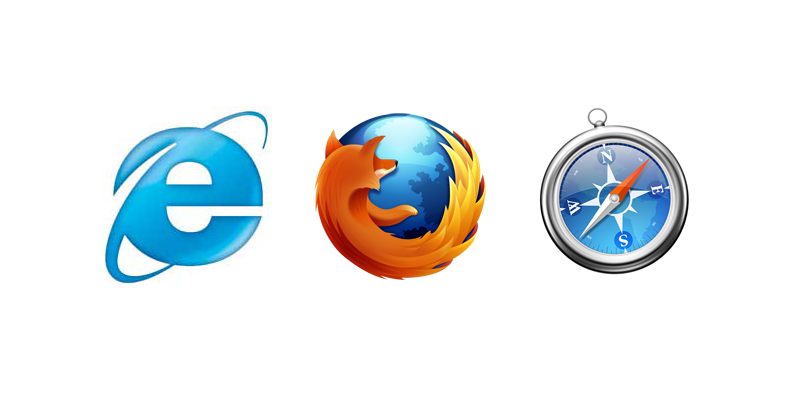
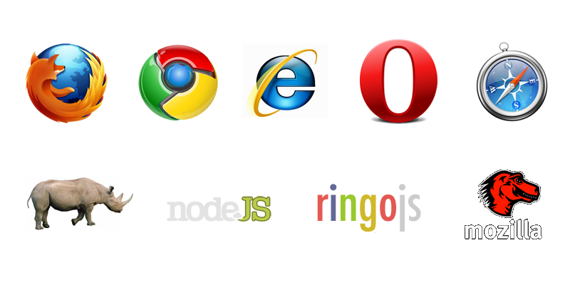

!SLIDE frontpage
# JS.Test
## Cross-platform JavaScript testing

!SLIDE bullets
# `whoami`

* James Coglan - @jcoglan
* Web developer at Songkick.com
* Open source: Faye, Sylvester, Bluff

!SLIDE center
# 2006: Many browsers

!SLIDE
# Problem: DOM implementations

    @@@ javascript
    if (element.addEventListener)
      element.addEventListener('click', callback, false)
    else if (element.attachEvent)
      element.attachEvent('onclick', callback)

!SLIDE callout
# Solution: 
## DOM libraries

!SLIDE center
# 2011: Many platforms

!SLIDE bullets
# Problem: Needless specialization

* Application frameworks _for Node_
* Testing libraries _for Node_
* Template languages _for Node_
* API clients _for Node_

!SLIDE center
# Most code is cross-platform

!SLIDE callout
# Solution:
## Test everywhere

