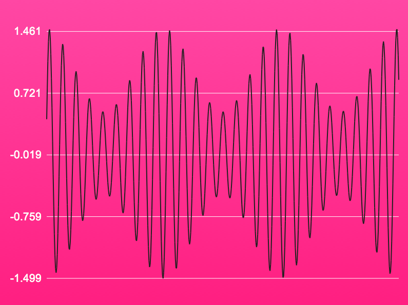

!SLIDE front
# Generating sound

!SLIDE center zoom

!SLIDE center zoom

!SLIDE center zoom

!SLIDE
# Simple generator

    @@@ javascript
    var audio = new Audio();
    audio.mozSetup(2, 44100);
    
    setInterval(function() {
      
      var time = new Date().getTime();
      var samples = note.timeSlice(time, 10, 44100);
      audio.mozWriteAudio(samples);
      
    }, 10);

!SLIDE
# Note sample generator

    @@@ javascript
    Note.prototype.timeSlice = 
    
    function(time, interval, rate) {
      var samples = Math.ceil(interval * rate / 1000),
          dt      = 1 / rate,
          data    = [];
      
      for (var i = 0; i < samples; i++) {
        var value = this.valueAt(time / 1000 + i * dt);
        data.push(value); // left channel
        data.push(value); // right channel
      }
      return data;
    };

!SLIDE
# Note value over time

    @@@ javascript
    Note.prototype.valueAt = 
    
    function(time) {
      var chan = this._channel,
          form = Sinewave.Note[chan._waveform],
          x    = this._frequency * time,
          y    = x - Math.floor(x),
          A    = chan._amplitude,
          AMx  = 2 * Math.PI * chan._am.frequency * time,
          AM   = chan._am.amplitude * Math.cos(Amx),
          E    = this._envelope.valueAt(time);
    
      return A * (1 + AM) * E * form(y);
    };

!SLIDE
# Discontinuous output

    @@@ javascript
    
    t =  0 -> write([ 0, 1, 2, 3, 4, 5, 6, 7, 8, 9])
    t = 10 -> write([10,11,12,13,14,15,16,17,18,19])
    t = 20 -> write([18,19,20,21,22,23,24,25,26,27])
    t = 30 -> write([32,33,34,35,36,37,38,39,40,41])

!SLIDE center zoom

!SLIDE
# Improved generator

    @@@ javascript
    var audio = new Audio();
    audio.mozSetup(2, 44100);
    
    var time = 0;
    
    setInterval(function() {
      
      time += 10;
      var samples = note.timeSlice(time, 10, 44100);
      audio.mozWriteAudio(samples);
      
    }, 10);
