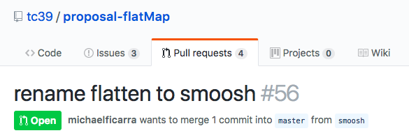

!SLIDE title
# ‘Breaking’


!SLIDE code small

```js
const http = {
  get(url, callback) {
    let request = /* make HTTP request */

    request.on('response', response => {
      callback({ status: 404 })
    })
  })
}

//----------------------------------------

const http = {
  get(url, callback) {
    let request = /* make HTTP request */

    request.on('response', response => {
      callback({ status: '404' })
    })
  })
}
```


!SLIDE code

```js
http.get(url, ({ status }) => {
  if (status == 404)
    console.log('not found')
})
```


!SLIDE code

```js
http.get(url, ({ status }) => {
  if (status === 404)
    console.log('not found')
})
```


!SLIDE code small

```js
const database = {
  count(table, callback) {
    let query = /* make SQL query */

    query.on('result', result => {
      callback({ count: 404 })
    })
  })
}

//----------------------------------------

const database = {
  count(table, callback) {
    let query = /* make SQL query */

    query.on('result', result => {
      callback({ count: '404' })
    })
  })
}
```


!SLIDE code

```js
// '3' - '2'
// -> 1

database.count('purchases', ({ count: p }) => {
  database.count('tickets', ({ count: t }) => {
    let remaining = t - p
  })
})
```


!SLIDE code

```js
// '3' + '2'
// -> '32'

database.count('workshops', ({ count: w }) => {
  database.count('talks', ({ count: t }) => {
    let sessions = w + t
  })
})
```


!SLIDE code

```js
database.count('workshops', ({ count: w }) => {
  database.count('talks', ({ count: t }) => {
    let sessions = parseInt(w, 10) +
                   parseInt(t, 10)
  })
})
```


!SLIDE title
# Traits
## a.k.a. capabilities, interfaces, type classes...


!SLIDE code

```js
// identity

http.get(url, ({ status }) => {
  if (status == 404)
    console.log('not found')
})
```


!SLIDE code

```js
// arithmetic

database.count('workshops', ({ count: w }) => {
  database.count('talks', ({ count: t }) => {
    let sessions = w + t
  })
})
```


!SLIDE title
# Changing interfaces


!SLIDE code

```js
function getTalkInfo(id) {
  return {
    title:     'Breaking changes',
    date:      '2018-06-03',
    presenter: 'James Coglan'
  }
}
```


!SLIDE code

```js
function getTalkInfo(id) {
  return {
    title:     'Breaking changes',
    date:      '2018-06-03',
    presenter: 'James Coglan',
    keywords:  ['types', 'semver']
  }
}
```


!SLIDE code

```js
function getTalkInfo(id) {
  return {
    date:      '2018-06-03',
    presenter: 'James Coglan'
  }
}
```


!SLIDE code

```js
let details = getTalkInfo(id)
return '<h1>' + details.title + '</h1>'

// -> <h1>undefined</h1>
```


!SLIDE code

```js
function getTalkInfo(id) {
  return {
    title:     'Breaking changes',
    date:      new Date(2018, 5, 3),
    presenter: { name: 'James Coglan' }
  }
}
```


!SLIDE code

```js
let details = getTalkInfo(id)
let [year, month, day] = details.date.split('-')

// -> TypeError:
//    details.date.split is not a function
```


!SLIDE bullets

- Adding new fields is fine
- Removing a field might break things
- Changing the type of existing fields, ditto


!SLIDE title
## Is it a map? Is it a record? Is it an object?
# No, it’s `[object Object]`


!SLIDE title code
# map, n.
An open-ended collection of key-value pairs; usually the keys and values are all
of the same type and accessed by iteration

```js
function printProfileUrls(users) {
  for (let name in users) {
    let url = users[name]
    console.log(name + ': ' + url)
  }
}
```


!SLIDE title code
# record, n.
A value with a fixed set of known fields; each field can have a different type
and is usually accessed by name

```js
const User = (props) => (
  <div>
    
    <a href={ props.url }>{ props.name }</a>
  </div>
)
```


!SLIDE title code
# object, n.
A computational value combining state with behaviour; like a record where some
fields hold functions that act on its data

```js
class Image {
  constructor(name) { this._name = name }

  url(size) {
    return 'https://images.example.com/' +
           this._name + '.' + size + '.png'
  }
}
```


!SLIDE code

```js
// webpack.config.js

module.exports = {
  notValidOption: true
  // ...
}

// in the shell:
$ webpack
Invalid configuration object.
Webpack has been initialised using a config
object that does not match the API schema.
 - configuration[0] has an unknown property
   'notValidOption'
```


!SLIDE code

```js
database.insert('talks', {
  title: 'Breaking changes',
  noSuchColumn: 'woops!'
})
```


!SLIDE title
# Conceptual complexity


!SLIDE



!SLIDE code

```js
Array.prototype.flatten = function() {
  return this.reduce((x, y) => x.concat(y), [])
}
```


!SLIDE code

```js
let things = [ true, 3, "hello",
               new Set([3]), null ]

things.flatten()
// -> ???
```


!SLIDE code

```js
new Buffer('4')   // -> <Buffer 34>

new Buffer(4)     // -> <Buffer 00 00 00 00>
```


!SLIDE code

```js
Buffer.from('4')

Buffer.alloc(4)
```


!SLIDE title
# Implied contracts


!SLIDE code

```js
function contains(list, value) {
  let count = 0
  for (let item of list) {
    if (item === value) count += 1
  }
  return count
}
```


!SLIDE code

```js
let set = new Set(['duck', 'duck', 'goose'])
contains(set, 'duck')
// -> 1
```


!SLIDE code

```js
function contains(list, value) {
  let items = list.filter(el => el === value)
  return items.length
}
```


!SLIDE code

```js
let list = ['duck', 'duck', 'goose']
contains(list, 'duck')
// -> 2

let set = new Set(['duck', 'duck', 'goose'])
contains(set, 'duck')
// -> TypeError: list.filter is not a function
```


!SLIDE title
# Side effects


!SLIDE code small

```js
function addDependency(name, version) {
  let pkg = JSON.parse(fs.readFileSync('package.json'))
  pkg.dependencies[name] = version
  fs.writeFileSync('package.json', JSON.stringify(pkg, true, 2))
}

//----------------------------------------

function addDependency(name, version) {
  let pkg = JSON.parse(fs.readFileSync('package.json'))
  pkg.dependencies[name] = version
  fs.writeFileSync('package.json', JSON.stringify(pkg, true, 2))
  console.log('Added dependency: ' + name)
}
```


!SLIDE code

```js
class Widget extends EventEmitter {
  setState(newState) {
    this.emit('change', newState)
    // ...
  }
}

//----------------------------------------

class Widget extends EventEmitter {
  setState(newState) {
    this.emit('change', newState, Date.now())
    // ...
  }
}
```


!SLIDE code

```js
widget.on('change', (...states) => {
  states.forEach(state => /* ... */)
})
```


!SLIDE bullets

# JavaScript
- is very permissive
- often gives unhelpful error messages
- has no way of telling the compiler about intended usage
