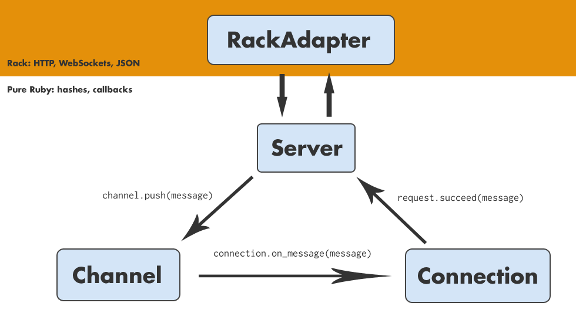

!SLIDE callout
# That’s nice
## But how does it work?


!SLIDE center
# Architecture




!SLIDE
# RackAdapter

```ruby
class Faye::RackAdapter
  def initialize(options = {})
    @options = options
    @server  = Server.new
  end

  def listen(port)
    handler = Rack::Handler.get('thin')
    handler.run(self, :Port => port)
  end
end
```

!SLIDE
# RackAdapter

```ruby
# POST /bayeux '{"channel": "..."}'

class Faye::RackAdapter
  def call(env)
    request  = Rack::Reqest.new(env)
    response = AsyncResponse.new
    message  = JSON.parse(request.body.read)

    @server.process(message) do |reply|
      response.succeed(JSON.unparse reply)
    end

    # Thin async protocol
    callback = env['async.callback']
    callback.call [200, {'Content-Type' => '...'}, response]
    [-1, {}, []]
  end
end
```

!SLIDE
# Server

```ruby
class Faye::Server
  def initialize
    @channels    = Channel::Tree.new
    @connections = {}
  end
end
```

!SLIDE
# Server

```ruby
# message = { 'id'       => '60esy10j',
#             'channel'  => '/some/channel',
#             'clientId' => '85b1xuzz',
#             'data'     => {'hello' => 'world'}
#           }

class Faye::Server
  def process(message, &callback)
    case message['channel']

      when '/meta/connect'
        accept_connection(message, &callback)

      when '/meta/subscribe'
        add_subscription(message, &callback)

      else
        distribute_message(message, &callback)
    end
  end
end
```

!SLIDE
# Server

```ruby
class Faye::Server
  def accept_connection(message, &callback)
    client_id  = message['clientId']
    connection = get_connection(client_id)

    connection.callback(&callback)
  end

  def get_connection(client_id)
    @connections[client_id] ||= Connection.new(client_id)
  end
end
```

!SLIDE
# Server

```ruby
class Faye::Server
  def add_subscription(message, &callback)
    connection   = get_connection(message['clientId'])
    channel_name = message['subscription']
    channel      = @channels.get(channel_name)

    connection.subscribe(channel)

    callback.call 'id'         => message['id'],
                  'successful' => true
  end
end
```

!SLIDE
# Server

```ruby
class Faye::Server
  def distribute_message(message, &callback)
    channel_name = message['channel']
    channels = @channels.glob(channel_name)

    channels.each do |channel|
      channel << message
    end

    callback.call 'id'         => message['id'],
                  'successful' => true
  end
end
```

!SLIDE
# Channel

```ruby
class Faye::Channel
  include Publisher

  def initialize(name)
    @name = name
  end

  def <<(message)
    publish(:receive, message)
  end
end
```

!SLIDE
# Connection

```ruby
class Faye::Connection
  include Deferrable

  def initialize(client_id)
    @client_id = client_id
    @channels  = Set.new
  end

  def subscribe(channel)
    return unless @channels.add?(channel)

    channel.add_listener(:receive) do |message|
      succeed(message)
      defer()
    end
  end
end
```
