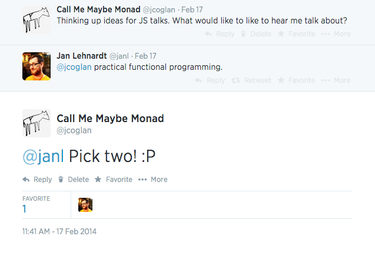

!SLIDE title
## http://slides.jcoglan.com
# Practical functional programming: pick two
## James Coglan / @jcoglan


!SLIDE




!SLIDE

> You can know what the name of that bird is in all the languages you want to
> know. And when you’ve finished with all that, you’ll know absolutely nothing
> whatever about the bird.

<cite>Richard Feynman</cite>


!SLIDE title
# Functional programming


!SLIDE

```coffee
# length :: [a] -> Int
length = (list) ->
    index = 0
    index++ while list[index] isnt undefined
    index
```


!SLIDE

```coffee
length ['Willkommen', 'in', 'Berlin']


```


!SLIDE

```coffee
length ['Willkommen', 'in', 'Berlin']

    index = 0


```


!SLIDE

```coffee
length ['Willkommen', 'in', 'Berlin']

    index = 0

    list[0] isnt undefined ?  ->  index++
        # index = 1


```


!SLIDE

```coffee
length ['Willkommen', 'in', 'Berlin']

    index = 0

    list[0] isnt undefined ?  ->  index++
        # index = 1

    list[1] isnt undefined ?  ->  index++
        # index = 2


```


!SLIDE

```coffee
length ['Willkommen', 'in', 'Berlin']

    index = 0

    list[0] isnt undefined ?  ->  index++
        # index = 1

    list[1] isnt undefined ?  ->  index++
        # index = 2

    list[2] isnt undefined ?  ->  index++
        # index = 3


```


!SLIDE

```coffee
length ['Willkommen', 'in', 'Berlin']

    index = 0

    list[0] isnt undefined ?  ->  index++
        # index = 1

    list[1] isnt undefined ?  ->  index++
        # index = 2

    list[2] isnt undefined ?  ->  index++
        # index = 3

    list[3] isnt undefined ?  ->  break
```


!SLIDE

```coffee
# [1, 2, 3, 4] is [1, [2, 3, 4]...]

# length :: [a] -> Int
length = ([x, xs...]) ->
    if x is undefined
        0
    else
        1 + length xs
```


!SLIDE

```coffee
    length ['Willkommen', 'in', 'Berlin']


```


!SLIDE

```coffee
length = ([x, xs...]) ->
    if x is undefined
        0
    else
        1 + length xs   # <--
```


!SLIDE

```coffee
    length ['Willkommen', 'in', 'Berlin']
 is 1 + length ['in', 'Berlin']


```


!SLIDE

```coffee
    length ['Willkommen', 'in', 'Berlin']
 is 1 + length ['in', 'Berlin']
 is 1 + (1 + length ['Berlin'])


```


!SLIDE

```coffee
    length ['Willkommen', 'in', 'Berlin']
 is 1 + length ['in', 'Berlin']
 is 1 + (1 + length ['Berlin'])
 is 1 + (1 + (1 + length [])


```


!SLIDE

```coffee
length = ([x, xs...]) ->
    if x is undefined
        0               # <--
    else
        1 + length xs
```


!SLIDE

```coffee
    length ['Willkommen', 'in', 'Berlin']
 is 1 + length ['in', 'Berlin']
 is 1 + (1 + length ['Berlin'])
 is 1 + (1 + (1 + length [])
 is 1 + (1 + (1 + 0))

```


!SLIDE

```coffee
    length ['Willkommen', 'in', 'Berlin']
 is 1 + length ['in', 'Berlin']
 is 1 + (1 + length ['Berlin'])
 is 1 + (1 + (1 + length [])
 is 1 + (1 + (1 + 0))
 is 3
```


!SLIDE

```coffee
# map :: (a -> b) -> [a] -> [b]
map = (f, list) ->
    result = []
    result.push(f x) for x in list
    result
```


!SLIDE

```coffee
# map :: (a -> b) -> [a] -> [b]
map = (f, [x, xs...]) ->
    if x is undefined
        []
    else
        [f(x), map(f, xs)...]
```


!SLIDE

```coffee
    square = (x) -> x * x

    map square, [1, 2, 3]


```


!SLIDE

```coffee
map = (f, [x, xs...]) ->
    if x is undefined
        []
    else
        [f(x), map(f, xs)...]   # <--
```


!SLIDE

```coffee
    square = (x) -> x * x

    map square, [1, 2, 3]
 is [1, map(square, [2, 3])...]


```


!SLIDE

```coffee
    square = (x) -> x * x

    map square, [1, 2, 3]
 is [1, map(square, [2, 3])...]
 is [1, [4, map(square, [3])...]...]


```


!SLIDE

```coffee
    square = (x) -> x * x

    map square, [1, 2, 3]
 is [1, map(square, [2, 3])...]
 is [1, [4, map(square, [3])...]...]
 is [1, [4, [9, map(square, [])...]...]...]


```


!SLIDE

```coffee
map = (f, [x, xs...]) ->
    if x is undefined
        []                      # <--
    else
        [f(x), map(f, xs)...]
```


!SLIDE

```coffee
    square = (x) -> x * x

    map square, [1, 2, 3]
 is [1, map(square, [2, 3])...]
 is [1, [4, map(square, [3])...]...]
 is [1, [4, [9, map(square, [])...]...]...]
 is [1, [4, [9, []...]...]...]

```


!SLIDE

```coffee
    square = (x) -> x * x

    map square, [1, 2, 3]
 is [1, map(square, [2, 3])...]
 is [1, [4, map(square, [3])...]...]
 is [1, [4, [9, map(square, [])...]...]...]
 is [1, [4, [9, []...]...]...]
 is [1, 4, 9]
```


!SLIDE

```coffee
# length :: [a] -> Int
length = ([x, xs...]) ->
    if x is undefined
        0
    else
        1 + length xs

# map :: (a -> b) -> [a] -> [b]
map = (f, [x, xs...]) ->
    if x is undefined
        []
    else
        [f(x), map(f, xs)...]
```


!SLIDE

```coffee
# length :: [a] -> Int
length = (list) ->
    index = 0
    index++ while list[index] isnt undefined
    index

# map :: (a -> b) -> [a] -> [b]
map = (f, list) ->
    result = []
    result.push(f x) for x in list
    result
```
