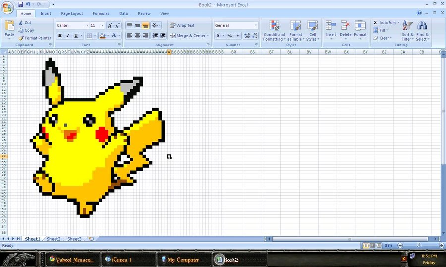

!SLIDE




!SLIDE big

```coffee
CoffeeScript    Haskell

[x, xs...]      x : xs
```


!SLIDE

```hs
map           :: (a -> b) -> [a] -> [b]
map _ []      =  []
map f (x:xs)  =  f x : map f xs

filter            :: (a -> Bool) -> [a] -> [a]
filter _ []       =  []
filter p (x:xs)
    | p x         =  x : filter p xs
    | otherwise   =  filter p xs

take                    :: Int -> [a] -> [a]
take n _      | n <= 0  =  []
take _ []               =  []
take n (x:xs)           =  x : take (n-1) xs
```


!SLIDE diagram

```hs
    take 3 (map (^2) (filter even [1..]))


```


!SLIDE diagram

```hs
    take 3 (map (^2) (filter even [1..]))
 == take 3 (map (^2) (filter even [2..]))


```


!SLIDE diagram

```hs
    take 3 (map (^2) (filter even [1..]))
 == take 3 (map (^2) (filter even [2..]))
 == take 3 (map (^2) (2 : filter even [3..]))


```


!SLIDE diagram

```hs
    take 3 (map (^2) (filter even [1..]))
 == take 3 (map (^2) (filter even [2..]))
 == take 3 (map (^2) (2 : filter even [3..]))
 == take 3 ((2^2) : map (^2) (filter even [3..]))


```


!SLIDE diagram

```hs
    take 3 (map (^2) (filter even [1..]))
 == take 3 (map (^2) (filter even [2..]))
 == take 3 (map (^2) (2 : filter even [3..]))
 == take 3 ((2^2) : map (^2) (filter even [3..]))
 == (2^2) : take (3-1) (map (^2) (filter even [3..]))

```


!SLIDE diagram

```hs
    take 3 (map (^2) (filter even [1..]))
 == take 3 (map (^2) (filter even [2..]))
 == take 3 (map (^2) (2 : filter even [3..]))
 == take 3 ((2^2) : map (^2) (filter even [3..]))
 == (2^2) : take (3-1) (map (^2) (filter even [3..]))
 == (2^2) : take 2 (map (^2) (filter even [3..]))
```


!SLIDE diagram

```hs
    (2^2) : take 2 (map (^2) (filter even [3..]))


```


!SLIDE diagram

```hs
    (2^2) : take 2 (map (^2) (filter even [3..]))
 == (2^2) : take 2 (map (^2) (filter even [4..]))


```


!SLIDE diagram

```hs
    (2^2) : take 2 (map (^2) (filter even [3..]))
 == (2^2) : take 2 (map (^2) (filter even [4..]))
 == (2^2) : take 2 (map (^2) (4 : filter even [5..]))


```


!SLIDE diagram

```hs
    (2^2) : take 2 (map (^2) (filter even [3..]))
 == (2^2) : take 2 (map (^2) (filter even [4..]))
 == (2^2) : take 2 (map (^2) (4 : filter even [5..]))
 == (2^2) : take 2 ((4^2) : map (^2) (filter even [5..]))


```


!SLIDE diagram

```hs
    (2^2) : take 2 (map (^2) (filter even [3..]))
 == (2^2) : take 2 (map (^2) (filter even [4..]))
 == (2^2) : take 2 (map (^2) (4 : filter even [5..]))
 == (2^2) : take 2 ((4^2) : map (^2) (filter even [5..]))
 == (2^2) : (4^2) : take (2-1) (map (^2) (filter even [5..]))

```


!SLIDE diagram

```hs
    (2^2) : take 2 (map (^2) (filter even [3..]))
 == (2^2) : take 2 (map (^2) (filter even [4..]))
 == (2^2) : take 2 (map (^2) (4 : filter even [5..]))
 == (2^2) : take 2 ((4^2) : map (^2) (filter even [5..]))
 == (2^2) : (4^2) : take (2-1) (map (^2) (filter even [5..]))
 == (2^2) : (4^2) : take 1 (map (^2) (filter even [5..]))
```


!SLIDE diagram

```hs
    (2^2) : (4^2) : take 1 (map (^2) (filter even [5..]))


```


!SLIDE diagram

```hs
    (2^2) : (4^2) : take 1 (map (^2) (filter even [5..]))
 == (2^2) : (4^2) : take 1 (map (^2) (filter even [6..]))


```


!SLIDE diagram

```hs
    (2^2) : (4^2) : take 1 (map (^2) (filter even [5..]))
 == (2^2) : (4^2) : take 1 (map (^2) (filter even [6..]))
 == (2^2) : (4^2) : take 1 (map (^2) (6 : filter even [7..]))


```


!SLIDE diagram

```hs
    (2^2) : (4^2) : take 1 (map (^2) (filter even [5..]))
 == (2^2) : (4^2) : take 1 (map (^2) (filter even [6..]))
 == (2^2) : (4^2) : take 1 (map (^2) (6 : filter even [7..]))
 == (2^2) : (4^2) : take 1 ((6^2) : map (^2) (filter even [7..]))


```


!SLIDE diagram

```hs
    (2^2) : (4^2) : take 1 (map (^2) (filter even [5..]))
 == (2^2) : (4^2) : take 1 (map (^2) (filter even [6..]))
 == (2^2) : (4^2) : take 1 (map (^2) (6 : filter even [7..]))
 == (2^2) : (4^2) : take 1 ((6^2) : map (^2) (filter even [7..]))
 == (2^2) : (4^2) : (6^2) : take (1-1) (map (^2) (filter even [7..]))

```


!SLIDE diagram

```hs
    (2^2) : (4^2) : take 1 (map (^2) (filter even [5..]))
 == (2^2) : (4^2) : take 1 (map (^2) (filter even [6..]))
 == (2^2) : (4^2) : take 1 (map (^2) (6 : filter even [7..]))
 == (2^2) : (4^2) : take 1 ((6^2) : map (^2) (filter even [7..]))
 == (2^2) : (4^2) : (6^2) : take (1-1) (map (^2) (filter even [7..]))
 == (2^2) : (4^2) : (6^2) : take 0 (map (^2) (filter even [7..]))
```


!SLIDE diagram

```hs
    (2^2) : (4^2) : (6^2) : take 0 (map (^2) (filter even [7..]))


```

!SLIDE diagram

```hs
    (2^2) : (4^2) : (6^2) : take 0 (map (^2) (filter even [7..]))
 == (2^2) : (4^2) : (6^2) : []


```

!SLIDE diagram

```hs
    (2^2) : (4^2) : (6^2) : take 0 (map (^2) (filter even [7..]))
 == (2^2) : (4^2) : (6^2) : []
 == [2^2, 4^2, 6^2]

```

!SLIDE diagram

```hs
    (2^2) : (4^2) : (6^2) : take 0 (map (^2) (filter even [7..]))
 == (2^2) : (4^2) : (6^2) : []
 == [2^2, 4^2, 6^2]
 == [4, 16, 36]
```
