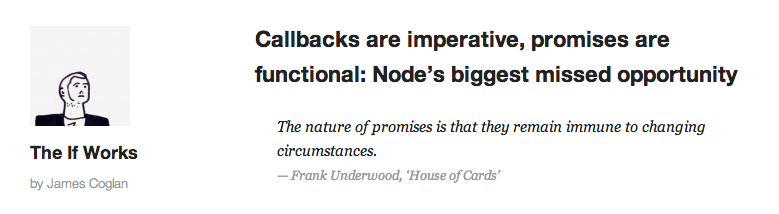

!SLIDE title
# Promises and types


!SLIDE



http://blog.jcoglan.com/2013/03/30/callbacks-are-imperative-promises-are-functional-nodes-biggest-missed-opportunity/


!SLIDE

> The nature of promises is that they remain immune to changing circumstances.

<cite>Frank Underwood, ‘House of Cards’</cite>


!SLIDE

```coffee
# fs.readFile :: Pathname -> Encoding -> Callback -> ()

# type Callback = Error -> Value -> ()

fs.readFile 'package.json', 'utf8', (error, file) ->
    console.log file unless error


!SLIDE

```coffee
async.parallel [
    (callback) ->
        fs.readFile 'package.json', 'utf8', callback
    ,
    (callback) ->
        url = 'https://api.github.com/users/faye/repos'
        http.get url, callback
    ,
    (callback) ->
        db.get 'users:4', callback

], (error, [file, response, user]) ->
    console.log file
    console.log response
    console.log user
```

!SLIDE


```coffee
fs.readFile 'package.json', 'utf8', (error, file) ->
    doSomethingWith file unless error

    async.parallel [
        (callback) ->
            url = 'https://api.github.com/users/faye/repos'
            http.get url, callback
        ,
        (callback) ->
            db.get 'users:4', callback

    ], (error, [response, user]) ->
        console.log response
        console.log user
```


!SLIDE

```coffee
async.parallel [
    (callback) ->
        fs.readFile 'package.json', 'utf8', (error, file) ->
            doSomethingWith file unless error
            callback error, file
    ,
    (callback) ->
        url = 'https://api.github.com/users/faye/repos'
        http.get url, callback
    ,
    (callback) ->
        db.get 'users:4', callback

], (error, [file, response, user]) ->
    console.log file
    console.log response
    console.log user
```


!SLIDE

```coffee
# fs.readFile :: Pathname -> Encoding -> Promise String
# http.get    :: URL -> Promise String
# db.get      :: String -> Promise String

# documents   :: [Promise String]

documents = [
    fs.readFile('package.json', 'utf8'),
    http.get('https://api.github.com/users/faye/repos'),
    db.get('users:4')
]

documents[0].then (file) -> # ...

Promise.all(documents).then (docs) -> # ...
```


!SLIDE

```coffee
# Promise.then :: Promise a -> (a -> b) -> Promise b

# doc   :: Promise String
# words :: Promise Int

words = doc.then (s) -> s.split(/\S+/).length


# Array.map :: [a] -> (a -> b) -> [b]

# docs  :: [String]
# words :: [Int]

words = docs.map (s) -> s.split(/\S+/).length
```


!SLIDE

```coffee
# documents :: [Promise String]
# words     :: [Promise Int]

words = documents.map (promise) ->
            promise.then (string) ->
                string.split(/\S+/).length
```


!SLIDE

```coffee
# Promise.all :: [Promise a] -> Promise [a]

# words       :: [Promise Int]
# allWords    :: Promise [Int]

allWords = Promise.all words

allWords.then ([fileWords, responseWords, userWords]) ->
    # ...
```
