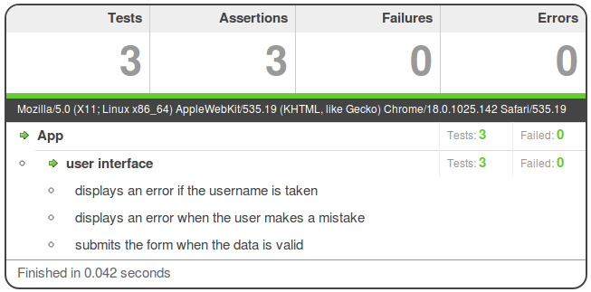

!SLIDE title
# An example problem
## Client-side form validation

!SLIDE
# Markup

    @@@html
    <form method="post" action="/users/new">
      

      
      <label for="username">Username</label>
      <input type="text" name="username" id="username">
      
      <label for="email">Email</label>
      <input type="text" name="email" id="email">
      
      <label for="password">Password</label>
      <input type="password" name="password" id="password">
      
      <input type="submit" value="Sign up">
    </form>

!SLIDE
# JavaScript

    @@@javascript
    form.on('submit', function(e) {
      e.preventDefault();
      var form = this, p = $('.error');
      
      if (!$('#username').val())
        return p.html('Please enter a username');
      
      if (!/^.+@.+/.test($('#email').val()))
        return p.html('Please give us your email address');
      
      // etc ...
      
      else
        form.submit();
    });

!SLIDE title
# So how do we test it?
## Without the CMD-S / ALT-TAB / F5 cycle

!SLIDE title
# Full-stack testing with Capybara & Selenium
## http://github.com/jnicklas/capybara

!SLIDE
# Selenium, via Capybara

    @@@ruby
    Capybara.default_driver = :selenium
    include Capybara::DSL
    
    it "allows sign-up with valid parameters" do
      visit "/signup"
      fill_in "Username", :with => "jcoglan"
      fill_in "Email", :with => "jcoglan@mailinator.com"
      fill_in "Password", :with => "super safe password"
      click_button "Sign up"
      page.should have_content("Welcome, jcoglan!")
    end

!SLIDE
# Selenium, via Capybara

    @@@ruby
    describe "with an existing user" do
      before { User.create(:username => "jcoglan") }
      
      it "does not allow sign-up with a registered name" do
        visit "/signup"
        fill_in "Username", :with => "jcoglan"
        fill_in "Email", :with => "jcoglan@mailinator.com"
        fill_in "Password", :with => "super safe password"
        click_button "Sign up"
        page.should_not have_content("Welcome, jcoglan!")
        page.should have_content("Sorry, that name is taken")
      end
    end

!SLIDE commandline incremental

    $ rspec --format nested spec/
    -- create_table(:users)
       -> 0.1468s

    App
      allows sign-up with valid parameters
      does not allow sign-up without a username
      does not allow sign-up with a weak password
      does not allow sign-up with a bad email address
      with an existing user
        does not allow sign-up with a registered name

    Finished in 17.67 seconds

!SLIDE title
# 3 whole seconds per test?
## How am I ever going to ship on time?

!SLIDE bullets
# If it takes too long you’re doing it wrong
* You’re only __really__ testing your JavaScript
* __Don’t__ exercise the server application
* __Don’t__ talk to the database
* __Don’t__ use slow browser automators

!SLIDE bullets
# Your client-side is a separate piece of software
* It runs on remote machines you don’t control
* It needs to work on dozens of platforms
* New browsers and OSes appear all the time

!SLIDE title
# Just use JavaScript
## Static HTML + JavaScript = portable code

!SLIDE bullets
# Buckets of tools
* Jasmine -- http://pivotal.github.com/jasmine
* QUnit -- http://docs.jquery.com/QUnit
* Mocha -- http://visionmedia.github.com/mocha

!SLIDE bullets
# My own framework: JS.Test
## http://jsclass.jcoglan.com/testing.html
* Emphasizes portability
* Minimizes global variables
* Works on browser and server-side platforms

!SLIDE
# Static test page

    @@@html
    

    
    
    
    

!SLIDE
# Runner script

    @@@javascript
    JS.Packages(function() { with(this) {
      file('http://code.jquery.com/jquery-1.7.2.min.js')
        .provides('jQuery')
      
      file(ROOT + '/lib/public/app.js')
        .provides('App').requires('jQuery')
      
      file(ROOT + '/spec/js/app_spec.js')
        .provides('AppSpec').requires('App')
    }})

    JS.require('JS.Test', function() {
      JS.require('AppSpec', function() { JS.Test.autorun() })
    })

!SLIDE
# Set up a use case

    @@@javascript
    AppSpec = JS.Test.describe("App", function() { with(this) {
      before(function() { with(this) {
        $("#fixture").html('\
          <form id="test-form" action="/users/new">\
            

\
            \
            <label for="username">Username</label>\
            <input type="text" name="username" id="username">\
            <!-- etc. -->\
            <input type="submit" value="Sign up">\
          </form>')
        
        this.form = $("#test-form")
        App.setupListeners(form)
      }})

!SLIDE
# Clean up afterwards

    @@@javascript
      after(function() { with(this) {
        $("#fixture").empty()
      }})
      
      it("does something", function() { with(this) {
        // ...
      }})
    }})

!SLIDE
# Add test examples

    @@@javascript
    it("displays an error when the user makes a mistake",
    function() { with(this) {
      
      form.find("#username").val("jcoglan")
      form.find("#email").val("not an email address")
      form.submit()
      
      assertEqual( "Please give us your email address",
                   form.find(".error").html() )
    }})

!SLIDE
# Extract inline JS into module

    @@@javascript
    App = {
      setupListeners: function(form) {
        form.on('submit', function(e) {
          e.preventDefault();
          var form = this, p = $('.error');
          
          if (!$('#username').val())
            return p.html('Please enter a username');
          
          // etc ...
          
          else form.submit();
        });
      }
    };

!SLIDE landscape
# Success!

!SLIDE landscape
# But what about...

!SLIDE
# Form reloads the page

    @@@javascript
    $('form').on('submit', function(e) {
      e.preventDefault();
      var form = this;
      
      // Handle errors ...
      
      // OH NOES! This will reload the page
      form.submit();
    });

!SLIDE
# Use mocking

    @@@javascript
    it("submits the form when the data is valid",
    function() { with(this) {
      
      expect(form[0], "submit") // expect form.submit()
      
      form.find("#username").val("jcoglan")
      form.find("#email").val("jcoglan@mailinator.com")
      form.find("#password").val("super safe password")
      form.submit()
    }})

!SLIDE landscape
# You’ll know if it’s not working

!SLIDE title
# Surprise new requirement!
## Usernames must be unique

!SLIDE
# We need to talk to the server

    @@@javascript
    var username = $('#username').val();
    
    jQuery.getJSON('/users/' + username, function(response) {
      if (response.successful)
        $('.error').html('Sorry, that name is taken');
      else
        form.submit();
    });

!SLIDE
# Stub out jQuery.getJSON()

    @@@javascript
    it("displays an error if the username is taken",
    function() { with(this) {
      
      stub(jQuery, "getJSON")
          .given("/users/jcoglan")
          .yields([{successful: true}])
      
      form.find("#username").val("jcoglan")
      form.find("#email").val("jcoglan@mailinator.com")
      form.find("#password").val("super safe password")
      form.submit()
      
      assertEqual( "Sorry, that name is taken",
                   form.find(".error").html() )
    }})

!SLIDE landscape
# Success!

!SLIDE title
# Step away from the DOM
## Test your business logic independently of the UI

!SLIDE
# Delegate data processing

    @@@javascript
    form.on('submit', function(e) {
      e.preventDefault();
      
      var form = this,
          data = App.extractData(form);
      
      App.validate(data, function(errors) {
        if (errors.length === 0)
          form.submit();
        else
          $(form).find('.error').html(errors[0]);
      });
    });

!SLIDE
# Delegate data processing

    @@@javascript
    App.validate = function(data, callback) {
      var errors = [];
      
      if (!data.username)
        errors.push('Please enter a username');
      
      // etc.
      
      $.getJSON('/users/' + data.username, function(response) {
        if (response.successful)
          errors.push('Sorry, that name is taken');
        
        callback(errors);
      });
    };

!SLIDE

    @@@javascript
      describe("validation rules", function() { with(this) {
        before(function() { with(this) {
          this.data = {
            username: "jcoglan",
            email:    "jcoglan@mailinator.com",
            password: "super safe password"
          }
          
          stub(jQuery, "getJSON")
              .yields([{successful: false}])
        }})
        
        it("yields no errors for valid data",
        function() { with(this) {
          App.validate(data, function(errors) {
            assertEqual( [], errors )
          })
        }})

!SLIDE

    @@@javascript
    it("yields an error if the username is blank",
    function() { with(this) {
      delete data.username
      App.validate(data, function(errors) {
        assertEqual( ["Please enter a username"], errors )
      })
    }})
    
    it("yields an error if there is an existing user",
    function() { with(this) {
      stub(jQuery, "getJSON")
          .given("/users/jcoglan")
          .yields([{successful: true}])
      
      App.validate(data, function(errors) {
        assertEqual( ["Sorry, that name is taken"], errors )
      })
    }})

!SLIDE landscape

