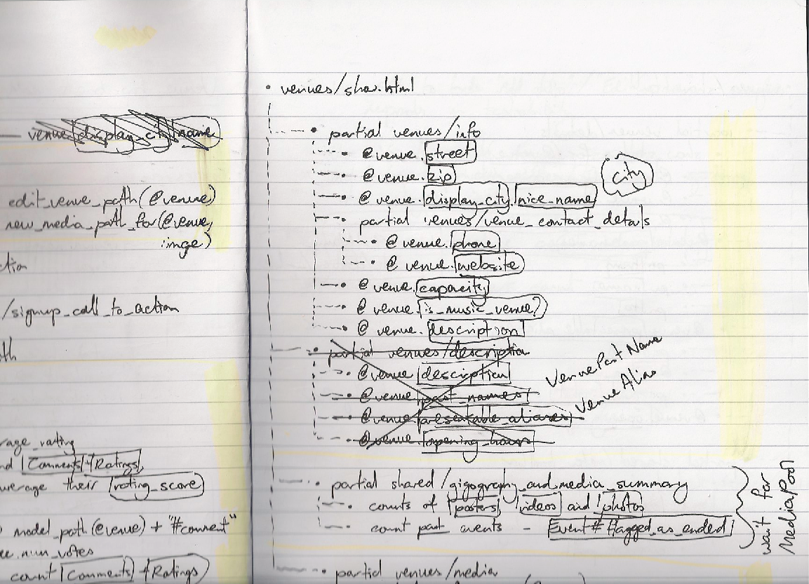

!SLIDE frontpage
# Primer
## The Cache That Knows Too Much

!SLIDE bullets
# `whoami`

* James Coglan - @jcoglan
* Developer at Songkick.com
* Open source: Faye, Heist, JS.Class

!SLIDE callout
# There are only two hard problems in Computer Science

!SLIDE callout
# Cache invalidation

!SLIDE callout
# Naming things

!SLIDE callout
# Off-by-one errors

!SLIDE bullets
# Cache invalidation

* Tedious to write code
* Tightly coupled to implementation
* Hard to test without deep knowledge
* Bugs, missed deadlines, pain

!SLIDE center
# Humble & Farley

“Asking experts to do boring and repetitive,
and yet technically demanding tasks is the most certain way of ensuring
human error that we can think of.”

!SLIDE
# The Rails way

    @@@ruby
    <% cache(:action_suffix => "all_topics") do %>
      <%= Topic.find(:all).map { ... } %>
    <% end %>
    
    class TopicObserver < ActiveRecord::Observer
      def after_create(topic)
        expire_fragment(:controller    => "topics",
                        :action        => "list",
                        :action_suffix => "all_topics")
      end
      
      def after_destroy(topic)
        # etc.
      end
    end

!SLIDE center
# 

!SLIDE callout
# TIMTOWTDI
## Denormalization increases complexity

!SLIDE bullets
# Songkick LOC

* Messaging: 338
* Silo: 570
* Renderers: 330
* Silovator: 2,500
* Apivator: 1,308
* ++ tests, cukes, config

!SLIDE frontpage
# :-(

!SLIDE
# Isn’t this enough?

    @@@ruby
    <% cache "/concerts/#{@concert.id}/title" do %>
      <%= @concert.title.upcase %>
    <% end %>
    
    # key "/concerts/#{@concert.id}/title"
    # depends on @concert.title. It says so
    # right there!

!SLIDE bullets incremental
# Primer

* Invalidates caches
* Has a name
* 1,488 LOC (inc. tests)

!SLIDE bullets
# There’s more

* Data caching
* Dependency monitoring
* Cache expiry and regeneration
* Change notification
* Offline processing
* Real-time updates
* ActiveRecord integration

