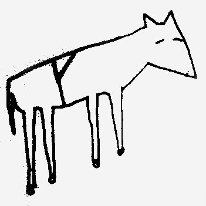

!SLIDE title
## http://slides.jcoglan.com
# Securing socket applications
## James Coglan / @jcoglan

!SLIDE bullets
# Who am I?

* Full-stack developer at Songkick
* Open-source Ruby and JavaScript hacker
* Author of Faye

!SLIDE

!SLIDE bullets
# Security is hard

* This is not the last word
* We do this to protect users first
* Conversation > flamewar

!SLIDE bullets
# Security concerns

* Authentication
* Privacy
* Cross-site scripting (XSS)
* Cross-site request forgery (CSRF)

