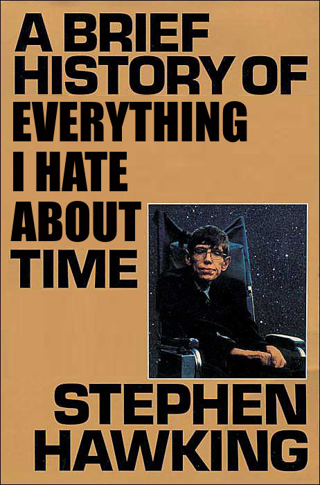
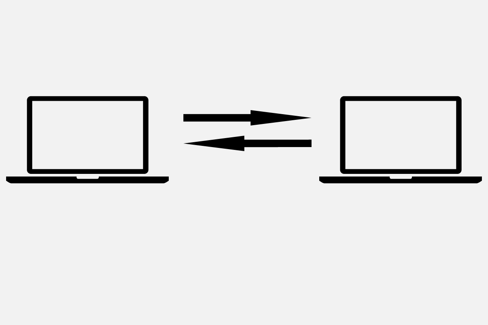

!SLIDE center

!SLIDE front
# Clock syncing

!SLIDE center zoom

!SLIDE front
# NTP
Resolution: 2 ^ -32 seconds

!SLIDE front
# JavaScript
Resolution: 2 ^ -3 seconds

!SLIDE center zoom

!SLIDE
# Time client

    @@@javascript
    c.publish('/time', {
      clientId: unique_id,
      t0:       currentTime()
    });
    
    c.subscribe('/time/' + unique_id, function(msg) {
      var ellapsed   = currentTime() - msg.t0,
          processing = msg.t2 - msg.t1,
          diff       = msg.t1 - msg.t0,
          transit    = ellapsed - processing;
      
      offset += diff - transit / 2;
    });

!SLIDE
# Time server

    @@@javascript
    
    s.subscribe('/time', function(message) {
      var received = currentTime(),
          channel  = '/time/' + message.clientId;
      
      s.publish(channel, {
        t0: message.t0,
        t1: received,
        t2: received
      });
    });

!SLIDE center zoom

!SLIDE center zoom

!SLIDE center zoom

!SLIDE center zoom

!SLIDE center zoom

