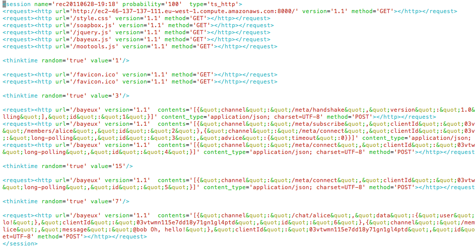
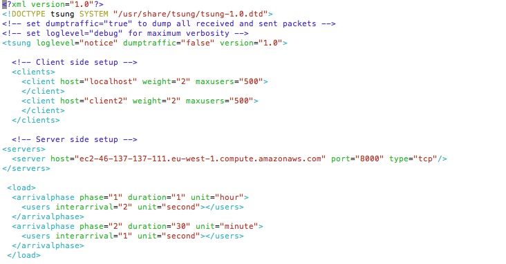
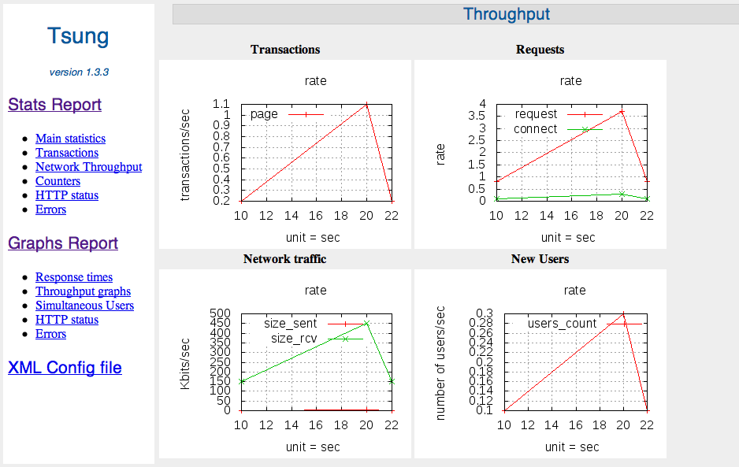

!SLIDE center
# Tsung
## An awesome distributed load simulator

!SLIDE center
# Get you some EC2s

!SLIDE center
# Install software

!SLIDE center
# Run traffic recorder

!SLIDE center
# Use the proxy

!SLIDE center
# Traffic logs

!SLIDE center
# Complete config

!SLIDE center
# Pretty graphs!

