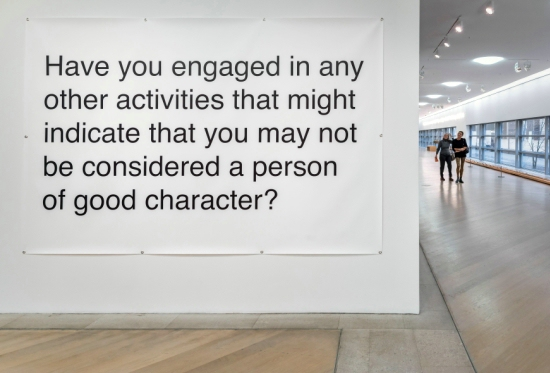
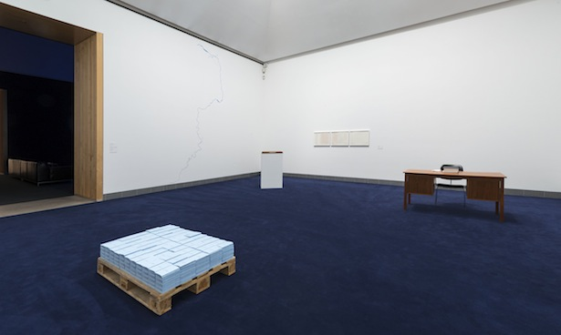

!SLIDE title
# What is string

!SLIDE title
# Building software is an act of representation.
## – Lena Reinhard, [Building a Future for Open Source](http://2014.jsconf.eu/speakers/lena-reinhard-this-is-bigger-than-us-building-a-future-for-open-source.html)

!SLIDE image

!SLIDE image

!SLIDE

> Compared to barbed wire fences, concrete walls and radical right-wing
> extremism, the exhibited letters in which the recipient’s name has been
> misspelled may seem to be of little importance. Many computers in Swedish
> companies and government organisations cannot handle the cedilla in Meriç, so
> the letter is either left out or replaced with, say, % or &#231. On closer
> consideration, however, the work _Ç (The Unfortunate Letter)_ is a striking
> example of just how structural and institutional the matter of identity and
> belonging is. The bureaucratic systems do not acknowledge all individuals’
> identities; they deny them the right to be without adjusting to an ancient
> construction (the Swedish alphabet). Symptomatically, the letter ç is excluded
> even in letters from the Migration Board.

!SLIDE big-quote

> so the letter is either left out or replaced with, say, % or <ins>&#231</ins>
> 
> – Printed material at the exhibition

!SLIDE big-quote

> so the letter is either left out or replaced with, say, % or <ins>ç</ins>
>
> – Copy on the [museum
> website](http://www.modernamuseet.se/en/Stockholm/Exhibitions/2014/Meric-Algun-Ringborg/About-the-exhibition/)

!SLIDE glyph
# ç
## LATIN SMALL LETTER C WITH CEDILLA
### U+00E7

!SLIDE big title
# sᵽɇȼɨȺł ȼħȺɍȺȼŧɇɍ
