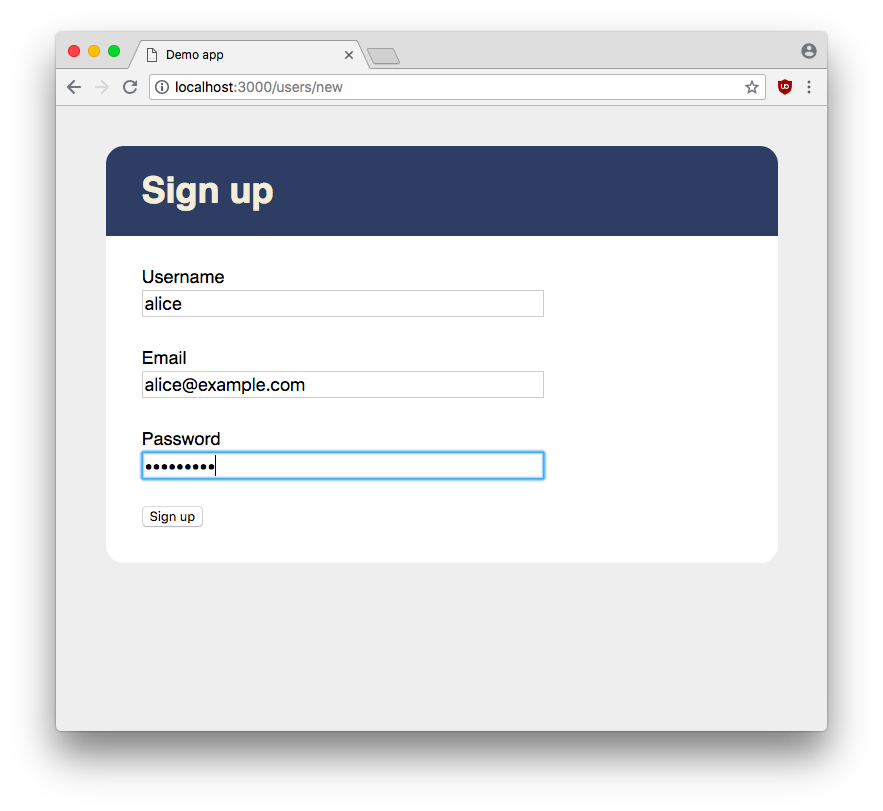
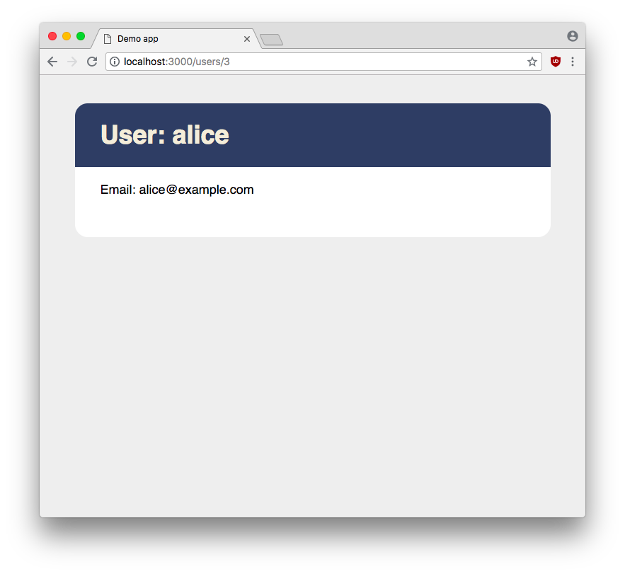

!SLIDE screenshot


!SLIDE screenshot


!SLIDE screenshot



!SLIDE screenshot



!SLIDE code small

```js
const { Sequelize, db } = require('../config/db')

const User = db.define('user', {
  username: {
    type: Sequelize.STRING,
    validate: { notEmpty: { msg: 'Username cannot be blank' } }
  },
  email: {
    type: Sequelize.STRING,
    validate: { isEmail: { msg: 'Email is not a valid address' } }
  },
  password: { type: Sequelize.STRING }
})
```


!SLIDE code

```js
app.get('/users/new', (request, response) => {
  response.render('users/new')
})
```


!SLIDE code

```html
<h1>Sign up</h1>

{{#if errors}}
  <ul class="errors">
    {{#each errors as |message|}}
      <li>{{message}}</li>
    {{/each}}
  </ul>
{{/if}}
```


!SLIDE code small

```html
<form method="post" action="/users" class="signup">
  <label>
    Username
    <input type="text" name="username" value="{{user.username}}">
  </label>

  <label>
    Email
    <input type="text" name="email" value="{{user.email}}">
  </label>

  <label>
    Password
    <input type="password" name="password" value="">
  </label>

  <input type="submit" value="Sign up">
</form>
```


!SLIDE code 

```js
app.post('/users', async (request, response) => {
  let user = User.build(request.body)

  try {
    await user.validate()
    await user.save()

    let redirect = `/users/${ user.id }`
    response.json({ ok: true, redirect })

  } catch (error) {
    let errors = error.errors.map(e => e.message)
    response.json({ ok: false, errors })
  }
})
```


!SLIDE code

```js
$(document).ready(() => {
  let form = $('form.signup')

  form.on('submit', event => {
    event.preventDefault()
    handleSignup(form) 
  })
})
```


!SLIDE code

```js
async function handleSignup(form) {
  let action   = form.attr('action'),
      params   = form.serialize(),
      response = await $.post(action, params)

  if (response.ok)
    return location.pathname = response.redirect

  let errors = errorList(form).empty()

  for (let msg of response.errors)
    errors.append($('<li></li>').text(msg))
}
```


!SLIDE code

```js
function errorList(form) {
  let errors = $('.errors')

  if (errors.length === 0)
    form.before('<ul class="errors"></ul>')

  return $('.errors')
}
```
