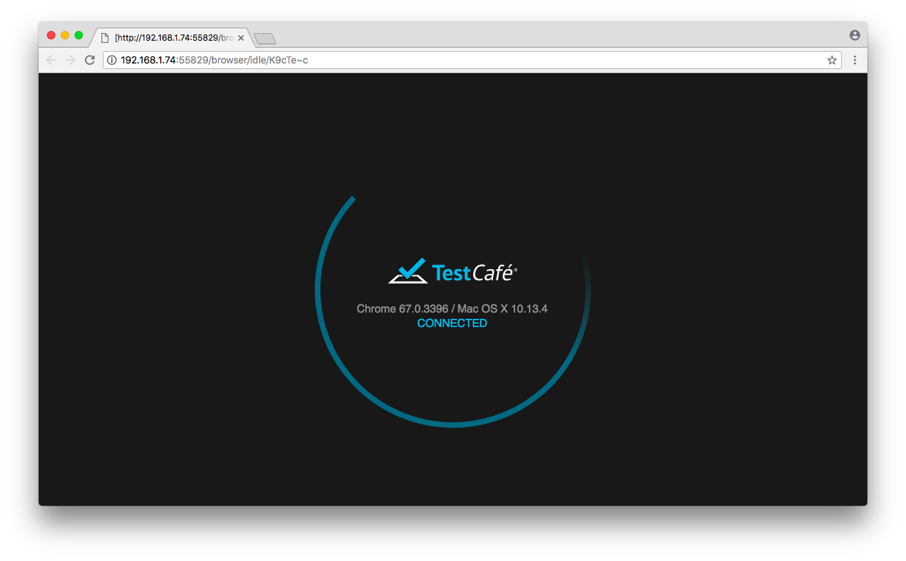
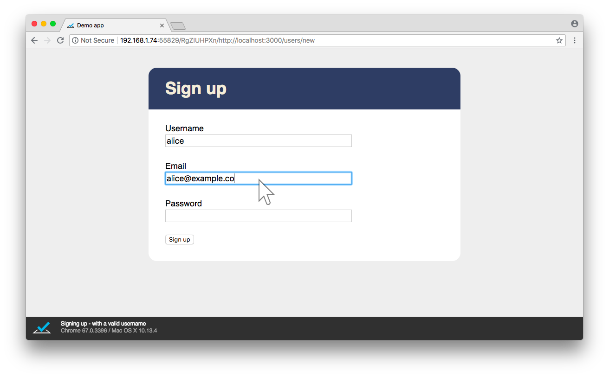

!SLIDE title
# Full-stack testing
## with TestCafé


!SLIDE code

```js
import { Selector } from 'testcafe'

let f = fixture `Signing up`
f.page `http://localhost:3000/users/new`

test('with a valid username', async t => {
  await t.typeText('[name=username]', 'alice')
  await t.typeText('[name=email]', 'alice@me.com')
  await t.typeText('[name=password]', 'something')
  await t.click('[type=submit]')

  let heading = await Selector('h1')
  await t.expect(heading.innerText)
        .contains('User: alice')
})
```


!SLIDE code

```js
test('using a blank username', async t => {
  await t.typeText('[name=email]', 'alice@me.com')
  await t.typeText('[name=password]', 'something')
  await t.click('[type=submit]')

  let error = await Selector('.errors li')

  await t.expect(error.innerText)
        .contains('Username cannot be blank')
})
```


!SLIDE code

```js
test('using an invalid email', async t => {
  await t.typeText('[name=username]', 'alice')
  await t.typeText('[name=email]', 'alice')
  await t.typeText('[name=password]', 'something')
  await t.click('[type=submit]')

  let error = await Selector('.errors li')

  await t.expect(error.innerText)
        .contains('Email is not a valid address')
})
```


!SLIDE code

```js
import User from '../../models/user'

f.afterEach(() => User.destroy({ truncate: true }))
```


!SLIDE



!SLIDE



!SLIDE code

```
Running tests in:
- Chrome 67.0.3396 / Mac OS X 10.13.4

Signing up
✓ with a valid username
✓ using a blank username
✓ using an invalid email

3 passed (5s)
```


!SLIDE code small

```
✖ using a blank username

  1) Cannot obtain information about the node because the specified
     selector does not match any node in the DOM tree.

     Browser: Chrome 67.0.3396 / Mac OS X 10.13.4

        22 |  await t.typeText('[name=password]', 'something')
        23 |  await t.click('[type=submit]')
        24 |
        25 |  let error = await Selector('.errors li')
        26 |
        27 |  await t.expect(error.innerText)
      > 28 |        .contains('Username cannot be blank')
        29 |})
        30 |
        31 |test('using an invalid email', async t => {
        32 |  await t.typeText('[name=username]', 'alice')
        33 |  await t.typeText('[name=email]', 'alice')
```


!SLIDE code

```
1/3 failed (16s)
```


!SLIDE bullets

# Full-stack testing

- Provides high confidence
- Slow and expensive
- Poor feedback
- Non-deterministic outcomes


!SLIDE title
# Misplaced confidence?
